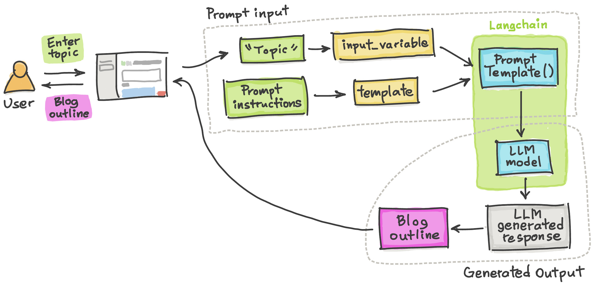

# 🦜🔗 Langchain - Blog Outline Generator App
```
Blog Outline Generator App built using Langchain and Streamlit
```




## Overview of the App
1. Accept user provided prompt as an input using Streamlit's `st.text_input()`
2. Create the final prompt by using `PromptTemplate()` to combine the **"topic"** and the **prompt instructions**.
3. The above prompt (from step 3) serves as an input to the OpenAI LLM model for generating a response (the blog outline)

## Demo App

[](https://langchain-outline-generator.streamlit.app/)

## Get an OpenAI API key

You can get your own OpenAI API key by following the following instructions:
1. Go to https://platform.openai.com/account/api-keys.
2. Click on the `+ Create new secret key` button.
3. Next, enter an identifier name (optional) and click on the `Create secret key` button.
